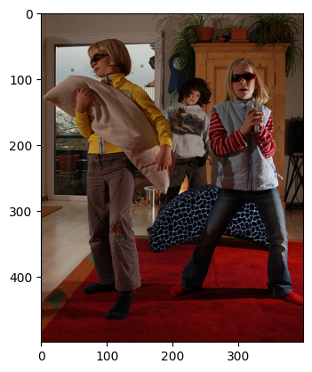

# Persian-VLM

This repository contains my implementation of **Persian CLIP** and **Persian Image Captioning** models, designed to improve vision-language tasks for the Persian language.

## Overview

Since the CLIP model does not perform well for Persian text, I implemented a **Persian CLIP model** by replacing the CLIP text encoder with **ParsBERT** and fine-tuning it using contrastive learning. Additionally, I used the learned image encoder to implement a **Persian image captioning model** using an RNN.

## Repository Structure

- **Persian CLIP (`Persian CLIP.ipynb`)**  
  - Implements CLIP for the Persian language.  
  - Uses **ParsBERT** as the text encoder.  
  - Fine-tuned using **contrastive learning**.  
  - Can be used for **zero-shot object detection, cross-modal retrieval (text-to-image and image-to-text search), and other vision-language applications**.

- **Persian Image Captioning (`Persian Image Captioning.ipynb`)**  
  - Uses the image encoder from Persian CLIP.  
  - Implements an **RNN-based image captioning model** for Persian.

## Applications

- **Zero-shot object detection**  
- **Image retrieval**  
- **Cross-modal retrieval (text-to-image and image-to-text search)**  
- **Persian image captioning**  

## Examples of Image Captioning

Here are some example outputs from the **Persian Image Captioning** model:

<table>
  <tr>
    <td align="center">
      
      
<strong>یک اسکی باز در حال اسکی کردن از تپه ای برفی است.</strong>

    </td>
     <td align="center">
      
      
<strong>مردم در یک بازار شلوغ در فضای باز</strong>

    </td>
    <td align="center">
      
      
<strong>سه دختر جوان د حال بازی با یکدیگر</strong>

    </td>
  <tr>
  <tr>
    <td align="center">
      
      
<strong>گروهی از زنان در حال رقصیدن در یک سالن رقص هستند.</strong>

    </td>
    <td align="center">
      
      
<strong>سه سگ در حال بازی در چمن</strong>

    </td>
    <td align="center">
      
      
<strong>مردی با پیراهن آبی در حال پریدن از روی تخته موج سوار است.</strong>

    </td>
  </tr>
</table>
